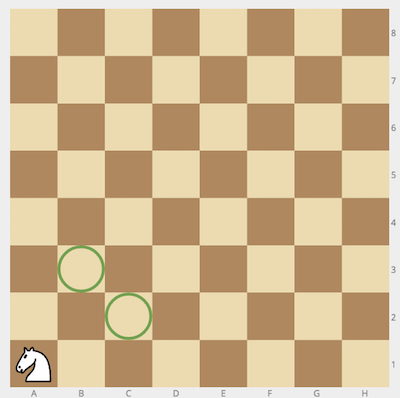
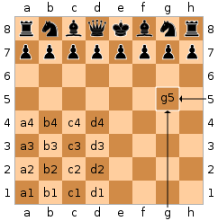

# chessKnight

Given a position of a knight on the standard chessboard, find the number of different moves the knight can perform.

The knight can move to a square that is two squares horizontally and one square vertically, or two squares vertically and one square horizontally away from it. The complete move therefore looks like the letter L. Check out the image below to see all valid moves for a knight piece that is placed on one of the central squares.

## Example

For `cell = "a1"`, the output should be
`solution(cell) = 2`.

For `cell = "c2"`, the output should be
`solution(cell) = 6`.

## Input/Output

- [execution-time-limit] 4 seconds (js)

- [input] string cell

String consisting of 2 letters - coordinates of the knight on an `8 × 8` chessboard in ***chess notation***.

***Chess notation***: Each square of the chessboard is identified by a unique coordinate pair—a letter and a number. The vertical columns of squares from white's left to the right are labeled `'a'` through `'h'`. The horizontal rows of squares are numbered `1` to `8` starting from white's side of the board. Thus each square has a unique identification as a string consisting of two characters: the first is the column label, and the second in the row number.

Guaranteed constraints:
`cell.length = 2`,
`'a' ≤ cell[0] ≤ 'h'`,
`1 ≤ cell[1] ≤ 8`.

- [output] integer
